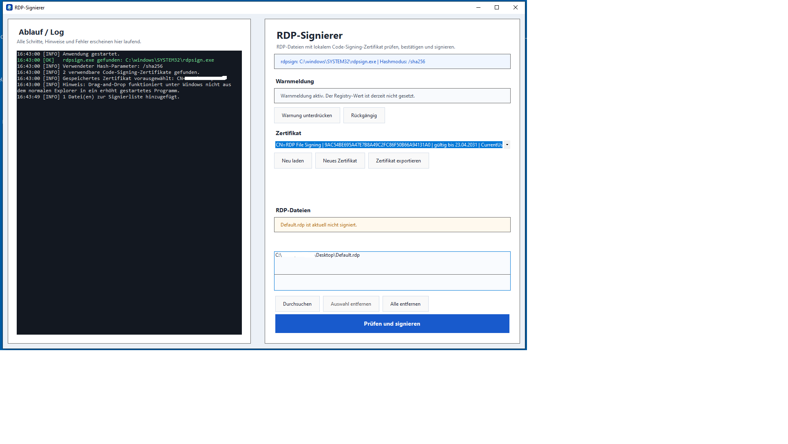

# RDP-Signierer

Windows-Werkzeug zum Signieren von `.rdp`-Dateien mit lokalem Zertifikat. Das Projekt enthält sowohl das ursprüngliche PowerShell-Script als auch die daraus entstandene WinForms-Anwendung.



## Inhalt

- `Sign-RdpFiles.ps1`: ursprüngliches PowerShell-Script
- `RdpSignTool.WinForms`: Windows-GUI als eigenständige `exe`

## Funktionen

- Live-Log mit Statusmeldungen
- Drag-and-Drop oder Dateiauswahl für `.rdp`-Dateien
- Zertifikatsauswahl, Zertifikatserstellung und Zertifikatsexport als `.cer`
- Signaturprüfung direkt in der App
- optionales Unterdrücken der RDP-Warnmeldung per Registry-Wert
- UAC-Anforderung nur für Registry-Aktionen, nicht für die gesamte App
- Veröffentlichung als einzelne `RdpSignierer.exe`

## Hinweis zur Signatur

Bei `.rdp`-Dateien ist der Windows-Explorer kein verlässlicher Signaturnachweis. Maßgeblich sind:

- die Signaturfelder `signature:s:` und `signscope:s:` in der Datei
- der Herausgeber-Hinweis beim Öffnen der RDP-Datei

## Lokal bauen

```bash
dotnet publish RdpSignTool.WinForms/RdpSignTool.WinForms.csproj \
  -c Release \
  -r win-x64 \
  --self-contained true \
  /p:PublishSingleFile=true \
  /p:IncludeNativeLibrariesForSelfExtract=true \
  /p:PublishTrimmed=false \
  -o publish/win-x64
```

Danach liegt die ausführbare Datei als `publish/win-x64/RdpSignierer.exe` vor.

## GitHub Releases

Für dieses Repository ist ein GitHub-Workflow hinterlegt, der bei Tags wie `v1.0.0` automatisch:

- die Windows-`exe` baut
- ein ZIP-Paket `RdpSignierer-win-x64.zip` erzeugt
- eine SHA-256-Datei erzeugt
- beides an ein GitHub Release anhängt

Beispiel:

```bash
git tag v1.0.0
git push origin v1.0.0
```

Der Workflow liegt unter `.github/workflows/release.yml`.
